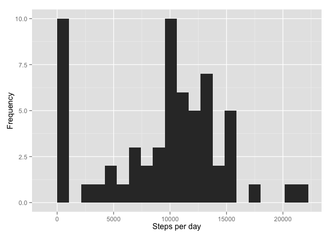
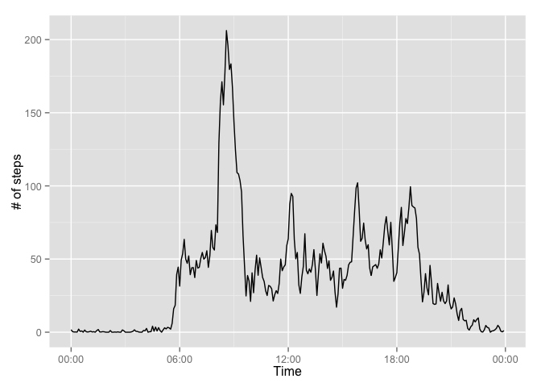
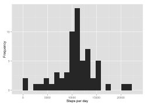
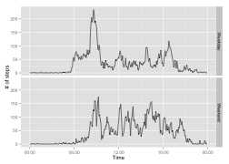

# Reproducible Data Analysis: Project 1
tbroiles  
February 5, 2016  

###Loading and preprocessing the data
We will begin by reading the data directly from the website.  We then created a timestamp for each measurement using the date and interval information.


```r
library(ggplot2)
library(scales)
knitr::opts_chunk$set(dev='png')
SPRINTF <- function(x) sprintf("%04d", x)
temp <- tempfile()
download.file('https://d396qusza40orc.cloudfront.net/repdata%2Fdata%2Factivity.zip', temp,method = 'libcurl')
data <- read.csv(unz(temp, "activity.csv"))
data$timestamp <- strptime(paste(as.character(data$date),SPRINTF(data$interval)), '%F %H%M')
unlink(temp)
```

###What is mean total number of steps taken per day?
The distribution of total steps taken per day is shown below. Additionally, the mean and median of the distribution is respectively 9354.2 and 10395 steps.


```r
steps_per_day <- tapply(data$steps, data$date, sum, na.rm = T)
rang = range(steps_per_day, na.rm = T)
qplot(steps_per_day, binwidth = (rang[2]-rang[1])/20, xlab = 'Steps per day', ylab = 'Frequency')
```

 

```r
print(paste0('Mean: ', sprintf('%5.1f',mean(steps_per_day)), ', Median: ', median(steps_per_day)))
```

```
## [1] "Mean: 9354.2, Median: 10395"
```

###What is the average daily activity pattern?

The peak in activity before 9 am.  It was computed below to have a peak at 8:35 am.


```r
y_mean_steps <- tapply(data$steps, data$interval, mean, na.rm = T)
pre_x_interval <- sort(unique(data$interval))
x_interval <- strptime(SPRINTF(pre_x_interval), '%H%M', tz = 'UTC')
generic_df <- data.frame(x_interval, y_mean_steps)
ggplot(generic_df,aes(x_interval, y_mean_steps)) + geom_line() + xlab('Time') + ylab('# of steps') + scale_x_datetime(labels = date_format("%R"))
```



```r
print(paste0('The maximum number of steps taken typically occurs at ', format(generic_df$x_interval[which(generic_df$y_mean_steps %in% max(generic_df$y_mean_steps))], "%H:%M"), '.'))
```

```
## [1] "The maximum number of steps taken typically occurs at 08:35."
```

###Imputing missing values

Missing values are replaced with the mean of a specific time interval.  Based on the results below, it is clear that replacing missing values significantly reduces the number of days with 0 steps, and shifts the distribution higher.  Further, the mean is shifted upward to 10766.2, and the median is also shifted upward to 10766.2.  I initially thought this was suspicious, but I looked closely at the output data and found that my replacement approach results in a value of 10766.2 for days that are completely filled with NA values, and becomes the distributions median value.  Consequently, I conclude that it's a big a coincidence, or the course instructor has a weird sense of humor.


```r
na_index <- is.na(data$steps)
print(paste('There are', sum(na_index),'missing values.'))
```

```
## [1] "There are 2304 missing values."
```

```r
new_data <- data
new_data$steps[na_index] <- y_mean_steps[which(pre_x_interval %in% data$interval[na_index])]

steps_per_day2 <- tapply(new_data$steps, new_data$date, sum, na.rm = T)
rang2 = range(steps_per_day2, na.rm = T)
qplot(steps_per_day2, binwidth = (rang2[2]-rang2[1])/20, xlab = 'Steps per day', ylab = 'Frequency')
```



```r
print(paste0('Mean: ', sprintf('%5.1f',mean(steps_per_day2)), ', Median: ', sprintf('%5.1f',median(steps_per_day2))))
```

```
## [1] "Mean: 10766.2, Median: 10766.2"
```

###Are there differences in activity patterns between weekdays and weekends?

We have seperated the data by time interval and by weekday or weekend.  Several interesting distinctions can be found.

* Activity on weekends begins several hours later in day.
* Activity on weekends does not include long periods of walking, but the activity level remains higher throughout the weekend.  In contrast, on weekdays the subject becomes more sedentary after 9 am.
* Activity on weekends goes on later in the evening.

This behavior suggests that the subject has a weekday job in an office from 9am-5pm.  The higher activity on weekday mornings before 9am, suggests the subject is rushing to work.  In contrast, the walking activity after work seems much more relaxed.

On weekends the subject likely sleeps later, and spends their time walking more throughout the day.


```r
data$dow <- as.factor(weekdays(data$timestamp))
data$weekends <- as.factor(data$dow %in% c('Saturday','Sunday'))

y_mean_steps <- tapply(data$steps[data$weekends == T], data$interval[data$weekends == T], mean, na.rm = T)
y_mean_steps <- append(y_mean_steps,tapply(data$steps[data$weekends == F], data$interval[data$weekends == F], mean, na.rm = T))
pre_x_interval <- sort(unique(data$interval))

x_interval <- strptime(SPRINTF(pre_x_interval), '%H%M', tz = 'UTC')
x_interval <- append(x_interval, x_interval)

dow <- rep('Weekend',length(unique(data$interval)))
dow <- append(dow, rep('Weekday',length(unique(data$interval))))

dow <- as.factor(dow)

generic_df <- data.frame(x_interval, y_mean_steps, dow)
ggplot(generic_df,aes(x_interval, y_mean_steps)) + geom_line() + xlab('Time') + ylab('# of steps') + scale_x_datetime(labels = date_format("%R")) + facet_grid(dow ~ .)
```


